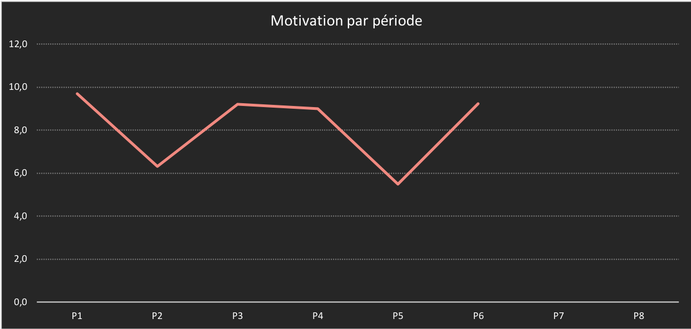
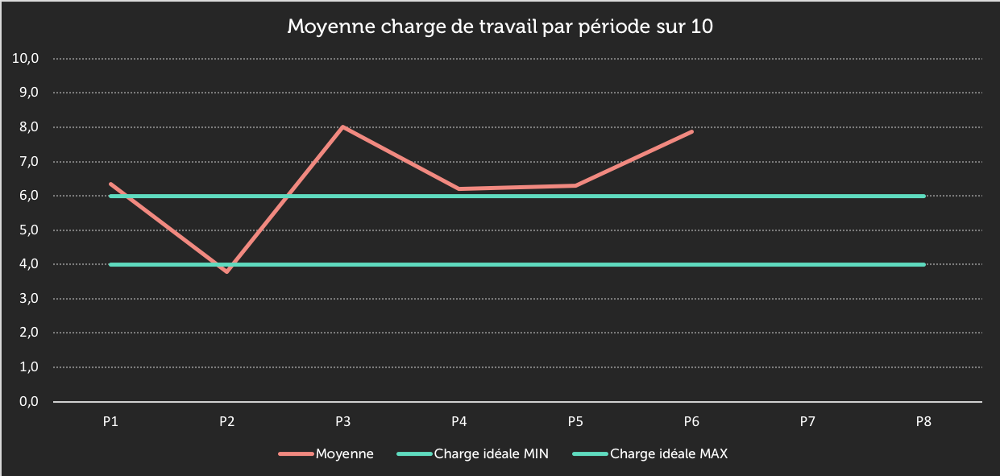
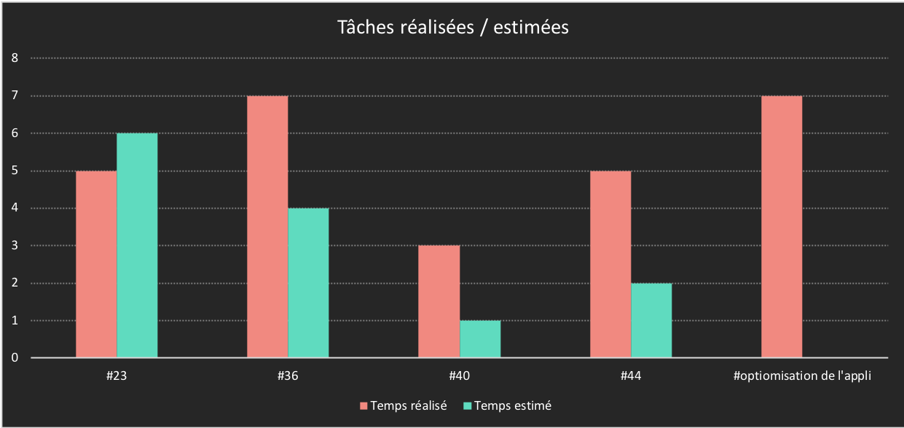

> Auteur : Robin MAGAT
> Document : Cahier de suivi
> Dernière mise à jour : 18/04/2018

# **CAHIER DE SUIVI**

## I. MANAGEMENT ET AUTO MANAGEMENT

### 1. Fixation d’objectifs en début de périodes

#### a. P1
- La charte interne pour les documentations
- Le template des pages de garde pour les documentations du projet

#### b. P2
- Prendre de l’avance pour la P4 en créant toutes les mockups.

#### c. P3
- Réaliser toutes les maquettes, application mobile, site internet et backoffice.

#### d. P4
- Développer des tâches Android et monter en compétences.

#### e. P5
- Développer des tâches Android et monter en compétences.

#### f. P6
- Développer des tâches Android et monter en compétences.

### 2. Etat des lieux en fin de périodes

#### a. P1
- Création de la charte interne
- Création du template des pages de garde

Même avec un léger retard, les objectifs ont été réalisé avant la fin période, ce qui à permis de répondre aux objectifs des rendus des
documentations de cette période.

#### b. P2
- Création des mockups de l’application mobile.

Toutes les mockup ont été préparer avec même de l'avance sur la création des maquettes

#### c. P3
- Création des maquette de l’application mobile, du site internet et du backoffice.

Toutes les maquettes réalisées avec validation du PO et grace à l'aide de deux ressources (Nicolas BRUNI et Alexandre PERRIN) et aussi du
à l'avance gagné sur la P2.

#### d. P4
- Développement de la vue de connexion à l’application
- Développement de la vue de gestion des photos (avec actions galeries et appareils photos).

Très bonne monté en compétences sur l'import des photos et ouverture de l'appareils depuis une Application Android.

#### e. P5
- Développement du swipe
- Développement de la descriptions d’une annonce
- Développement de la gestion des filtre de la recherche

Montée en compétences sur de la R&D du swipe. Problème sur l'import des icônes au format SVG.

#### f. P6
- Développement de la vue avec la video d'introduction de l'application.
- Développement de la vue du choix de langue et la fonction qui change la langue de l'application.
- Développement de la vue des statistiques d'une annonce.

Montée en compétences sur la fonction de changement de langue.

### 3. Construction et utilisation d’indicateurs

## II. ANALYSE

### 1. Identification des écarts objectifs/réalisés

#### a. P1

Beaucoup trop de perte de temps à la recherche d’idée pour le template des pages de garde des documentations.

Prises de décision : 
Garder un code couleur unique sur le template des pages de garde. Gain de temps en réalisant qu’un seul template de pages de garde pour tout les type de document.

#### b. P2

Aucun écart, mon objectifs était de prendre de l’avance pour les maquettes de P3.

#### c. P3

Avec l’avance de P2, aucun écart d’objectifs durant cette période.

#### d. P4

La réalisation de mes tâches a eu aucun impact sur les rendu de fin de periode.

#### e. P5

Quelque perte de temps pour trouvé la bonne bibliothèque pour les double spine bar (pour en trouvée une compatible API 21).

#### f. P6

### 2. Conclusion

#### a. P1

Les prises de décisions aurait dus être décidé à la mise en place des objectifs de la période.

#### b. P2

Prendre de l’avance sur les mockups était la bonne chose à faire vue la charge de travail m’étant assigner pour la P3 avec en plein milieu le cercle de projet.

#### c. P3

Très satisfait de moi car vue la charge de travail, les livrable design ont était rendu dans les temps.

#### d. P4

Une exélente période pour moi, très motivé et une très bonne monté en compétence en Android.

#### e. P5

Quelque soucis avec le mon binome Kévin POLI et des problèmes de compatibilité API 21. Globalement, une période moyenne pour moi.

#### f. P6
